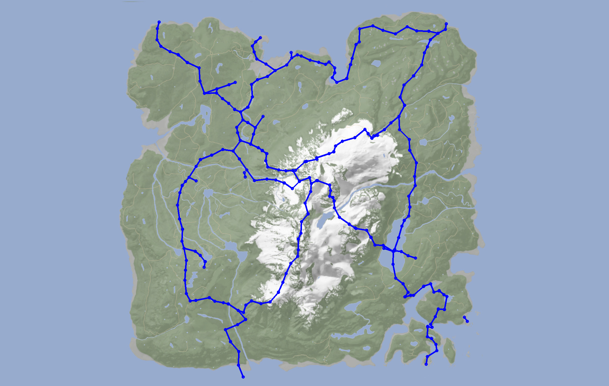

# Sons Of The Forest Zipline Point Mapper


## Table of Contents
- [Introduction](#introduction)
- [Prerequisites](#prerequisites)
- [Installation](#installation)
- [Usage](#usage)
- [License](#license)

## Introduction
The Sons Of The Forest Zipline Point Mapper is a Python script designed to extract zipline point data from game saves of the popular survival game, Sons Of The Forest, and plot these points on a map using OpenCV. With this tool, you can visualize the location of ziplines within the game world, making it easier to plan your in-game adventures.

This README provides instructions on how to install and use the script to map zipline points from Sons Of The Forest game saves.

Please note that this script is not perfect, it uses a static pixel to coordinates ratio and the ziplines are little bit shifted. Still it provides a nice way to navigate when you have a lot ziplines on the map 😀

## Example

## Prerequisites
Before using the Sons Of The Forest Zipline Point Mapper, ensure you have the following prerequisites:

- Python 3.x installed on your system.
- Required Python libraries: OpenCV (cv2) and NumPy (numpy). You can install these libraries using pip:
bash
```sh
pip install opencv-python-headless numpy
```
- A Sons Of The Forest game save file (ZipLineManagerSaveData.json) from which you want to extract zipline points. You can find these save files in the game's save directory (might be in a zip file).

## Installation
Clone this repository or download the script directly from GitHub.
```sh
git clone https://github.com/garther/sonsoftheforest-zipline-mapper.git
```
Navigate to the project directory:
```sh
cd sonsoftheforest-zipline-mapper
```
You're ready to use the script!

## Usage
Follow these steps to use the Sons Of The Forest Zipline Point Mapper:
- Place your Sons Of The Forest game save file (*.sav) in the same directory as the script.
- Open a terminal or command prompt.
- Run the script, providing the name of your game save file as a command-line argument:

```sh
#usage: zipliner.py [-h] [INPUT_FILE] [OUTPUT_FILE]
python zipliner.py ZipLineManagerSaveData.json zipline_map.png
```
The script will extract the zipline point data from the game save and generate an image showing the zipline points on a map.

The resulting image will be saved in the same directory with the name zipline_map.png.

You can open zipline_map.png using any image viewer to view the mapped zipline points.

Customize the script further as needed by modifying the code to suit your requirements. You can change the appearance of the plotted points, adjust the map's background, or add additional functionality.

## License
This project is licensed under the MIT License - see the LICENSE file for details.

Feel free to contribute to this project or report any issues on GitHub. Happy gaming and mapping!
